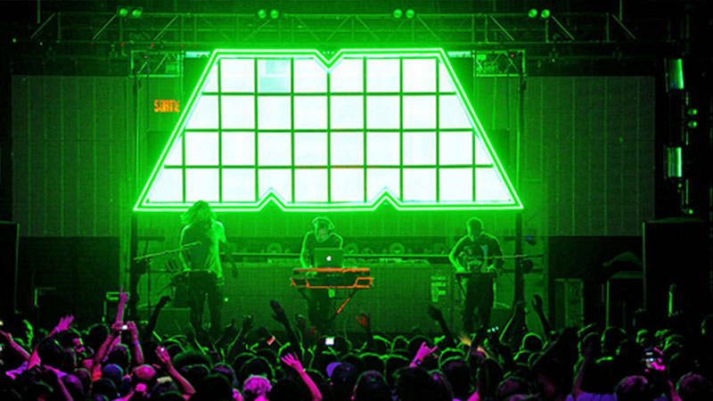
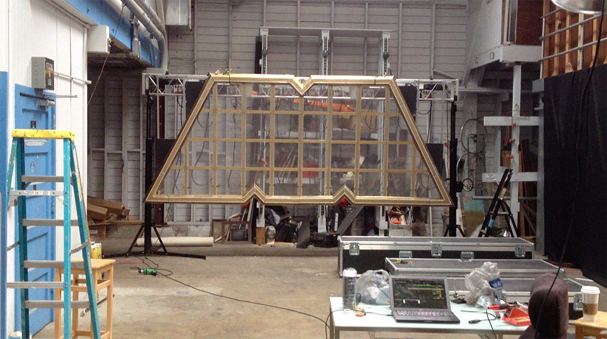
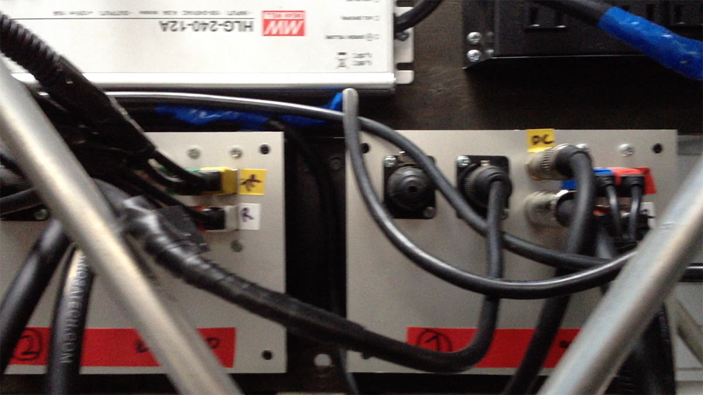
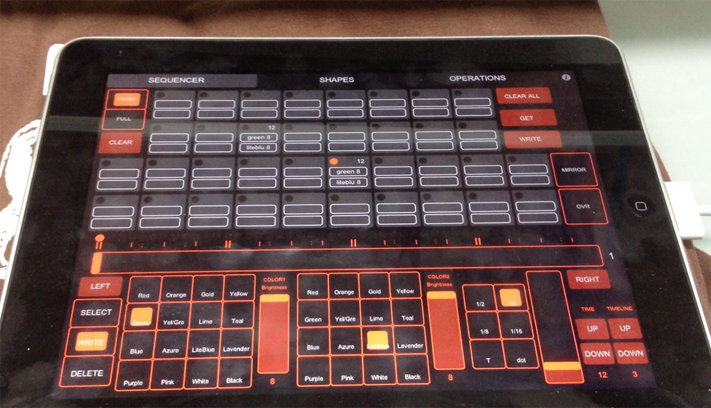
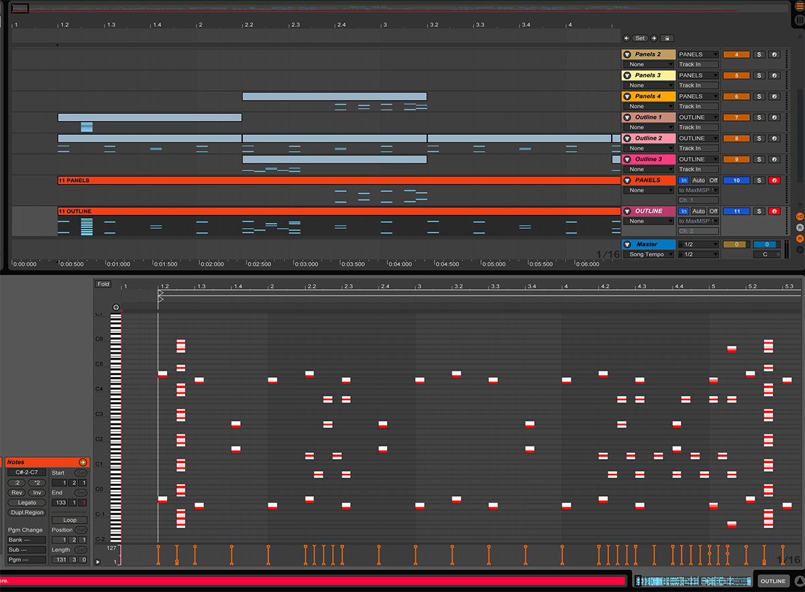

 {.full-width}

In 2010, Eric Luttrell, Ben Swardlick founded The M Machine, and decided to embark on a remarkable journey that would take us around the world.

At the time, I was extremely excited about synchronized visuals (think Daft Punk's 2006 Pyramid Coachella show) and was doing a ton of experimentation with driving LEDs with Arduino and Max / MSP. What started out as a set of experiments evolved into what became the centerpiece for our band's early years, a giant LED M stagepiece that we performed with across the country.

<video src="./m-light-wall-03.webm" width="100%" autoplay loop class="glare-thumbnail"></video>

The real-life M Machine was over 18" wide, consisting of 36 18"x18" acrylic light-guiding panels with RGB LED illuminating the interior using FTIR. I ordered the acrylic panels custom from a supplier in China, and was shocked to learn that they weighed over 1000 pounds and would have to be delivered by cargo container. They'd prove to be incredibly durable and withstand 100s of shows and 1000s of miles of travel.

 {.full-width}

Each panel was driven by an RGB DMX controller, with current actually delivered over USB (A super-cheap, durable 4-wire conductor). The M frame attached to the M was actually aluminum gutter from Lowe's, cut to shape, and outfitted with 20 additional channels of LED ribbon. The entire stagepiece consumed about 12A of power at full white brightness.

 {.full-width}

<video src="./m-light-wall-02.webm" width="100%" autoplay loop class="glare-thumbnail"></video>

I sequenced the visuals using a suite of custom software that I built for the task - I used a touchOSC interface that I built on my iPad which communicated via OSC with a Max For Live plugin. Basically, the touchOSC interface had a timeline of one bar divided into 48 keyframes on a timeline (allowing for 16th notes or 12th note triplets). Each keyframe had an array of buttons corresponding to each panel / outline piece. For any given panel / outline, you picked a start color and brightness, end color and brightness, and duration, then assigned it to a panel at a given position on the timeline. I used 16 colors with 8 brightness steps and encoded them into each of the 16 divisions of the 7-bit MIDI value.

```
MIDI velocity |00 01 02 03 04 05 06 07|08 09 10 11 12 13 14 15|...
color         |red                    |blue                   |...
brightness    |1  2  3  4  5  6  7  8 |1  2  3  4  5  6  7  8 |...
```

 {.full-width}

These three parameters were encoded as three MIDI notes, and touchOSC would "print" these MIDI notes into clips in Ableton using Max for Live. Ableton would play back the encoded MIDI signals, outputting them to another Max patch, which would decode the MIDI triplet and output DMX signal to drive the LED wall.

 {.full-width}

<video src="./m-light-wall-04.webm" width="100%" autoplay loop class="glare-thumbnail"></video>

Working bar-by-bar, and tile-by-tile, I sequenced out visual representations of our music - thousands of hours of work at what I can only describe as an extremely esoteric skill. I constantly learned new tricks, and continually iterated on the tooling to improve the "developer experience" - adding a mirror-mode, allowing Ableton to send data back to the iPad for editing, and creating a whole suite of macro tools for patterns that I used frequently.

 {.full-width}

What's perhaps most interesting about The real-life M Machine is how richly varied the expression of visual metaphor language it provided was - I sequenced visuals for more than 30 songs, and never really repeated myself too similarly - each track had its own color palette, and each sound had its own visual representation. Also striking is how important one's innate feeling of physics is to creating audio-visual synchronization - the attack or decay of a light (how quickly it turns on or off), and how well it matches that of the sound it represents, quickly transforms the light into something directly tied into the sound, as if it's the thing making the sound or vice versa.

I'm incredibly proud of my homemade M Machine, and truly loved performing with it. It's later video-only incarnations, while infinitely more expressive and creatively interesting, never matched this project in terms of ambition and pure, striking power.

<video src="./m-light-wall-01.webm" width="100%" autoplay loop class="glare-thumbnail"></video>

#### links

[a video explanation of sequencing process](https://www.youtube.com/watch?v=vdAZHYFNbWU)<br/>
[feature in WIRED](http://www.wired.com/2012/04/m-machine-artist-collective/)<br/>
[feature in Intel iQ](http://iq.intel.com/concerts-2-0-the-m-machine-revamps-the-visual-experience/)<br/>
