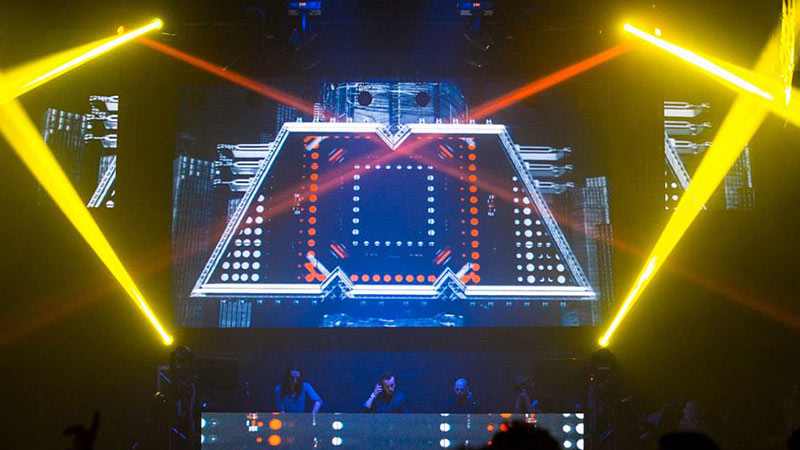
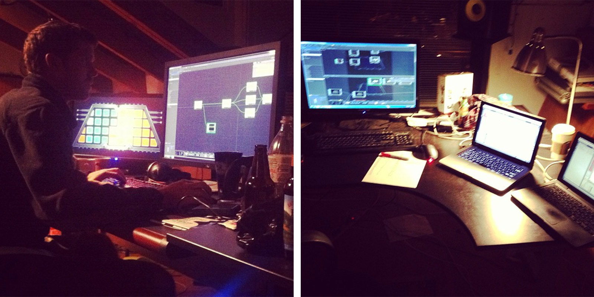
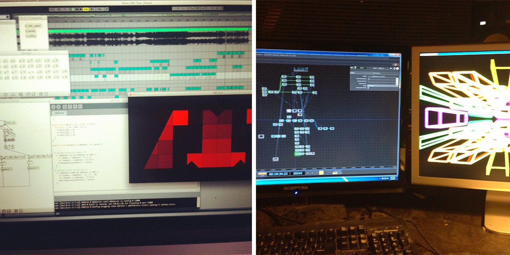
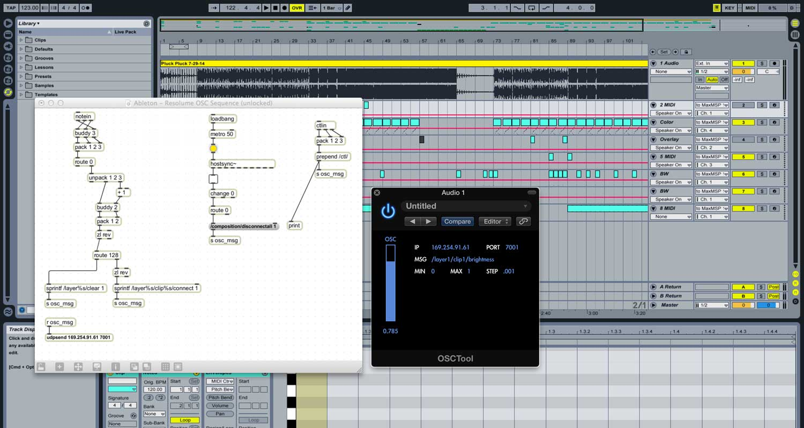

 {.full-width}

In early 2013 The M Machine were invited to play at Ultra Music Festival in Miami, and we began the process of designing a new live show complete with an entirely new visual package. While the physical M light wall was a truly impressive stagepiece, it was impractical to tour with, particularly for festival shows where stage transition time is very limited.

<video src="./m-video-wall-05.webm" width="100%" autoplay loop></video>

 {.full-width}

<video src="./m-video-wall-03.webm" width="100%" autoplay loop></video>
<video src="./m-video-wall-04.webm" width="100%" autoplay loop></video>

 {.full-width}

<video src="./m-video-wall-01.webm" width="100%" autoplay loop></video>

 {.full-width}

<video src="./m-video-wall-02.webm" width="100%" autoplay loop></video>
