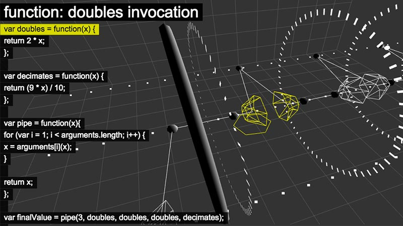

 {.full-width}

holograf was my thesis project at [Hack Reactor](http://www.hackreactor.com/), which I built with an incredible team ([Luke Davis](https://github.com/lucaswadedavis), [Matt Conrad](https://github.com/conrad) and [Ryan Lee](https://github.com/ryanjlee)). It began as a question that Luke and I would often toss around while talking shop - what if you could write a program just like you would work with a physical machine?

holograf is a 3D algorithm and program flow visualizer that traces every value throughout a program's execution and allows the user to explore the execution in 3D using three.js. In essence, holograf is a **re** compiler, tracking the program's execution by injecting watchpoints at every point of the program and tracking its execution. Here's how it works:

- convert the program into an abstract syntax tree (AST) using [`esprima`](http://esprima.org/)
- use a recursive descent parser to traverse the AST, injecting new nodes into the tree that will track the execution of each line as it runs (recording every detail of the program's exection including variable values, scope, and line numbers)
- regenerate code from the modified AST and execute it, generating a data structure representing the execution timeline and captured information of the program's execution
- generate a 3D representation of the program's execution using a range of visual representations generated by three.js

---

<video src="./holograf_demo.webm" width="100%" autoplay loop class="holograf-thumbnail"></video>

---

[\<source />](https://github.com/cannoneyed/holograf)
