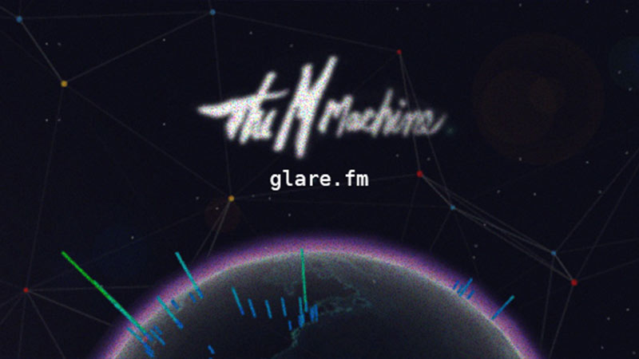

 {.full-width}

In the early parts of 2016 The M Machine and I got together to start brainstorming some new ideas for releasing the body of music that we had written right before I left the group. The full-length album, [Glare](https://itunes.apple.com/us/album/glare/id1180873312), was the culmination of years of work and was something that I was immensely attached to. We'd all spent so many grueling hours laboring over the music on that record, so it was very important that we do something a bit more interesting than the usual social media / blog / spray-and-pray approach for releasing it.

The record itself really emphasizes the human side of music - big, monstrous bass drops are replaced with luscious, organic textures and the driving mechanical rhythms of our earlier techno music was replaced with a lighter and more personal touch. This was all very deliberate - we'd been growing more and more disenchanted with the contemporary EDM machine when we wrote the bulk of the music, and were really longing for the music we grew up with - emotional,  full of narrative and meaning, and most importantly - personal.

We were immediately struck by the idea of sharing music in person - remembering what it was like to get a burned copy of a CD from a friend, and how it felt so much more special to get new music then. What if we built a tool where the only way you could get the record was from someone who already had it, in person?

---

<figure>
    <video src="./glare_interaction_basic.webm" width="50%" autoplay loop class="glare-thumbnail"></video>
    <figcaption><a href="http://glare.fm" title="glare.fm home screen - the album's spread">glare.fm home screen - the album's spread</a>.</figcaption>
</figure>

Over the next few months I developed the web app [glare.fm](https://www.glare.fm), through which we pre-released the record. From November 2016 to February 2017 (when the album was officially released through "normal" channels), the album spread across the world, literally from person to person. More than 1000 people from 12 countries listened to Glare before it was released through this deliberately limiting platform.

---

<figure>
    <video src="./glare_dot_fm_share_demo.webm" width="50%" autoplay loop class="glare-thumbnail"></video>
    <figcaption><a href="http://glare.fm" title="glare.fm share mechanism">glare.fm share mechanism</a>.</figcaption>
</figure>

glare.fm uses a novel geolocation-based mechanism for transferring access to the record from one person to another - At the time I started building the app, I was extremely interested in "serverless" web apps, and elected to build the app using [firebase](https://firebase.google.com/) for both its real-time updates and its built-in oauth user authentication. Working with firebase wound up presenting a number of challenges, most of which were caused by the extremely odd way that Google elected to change the firebase client API after their acquisition of the service.

We elected to build a web app, rather than a native app, for a number of reasons - the biggest advantages were rapid iteration with web technologies, no app store review / update process, and the ease of distribution / sharing through a simple url.

glare.fm was a project that quickly grew in scale and ambition, and, as such, presented a number of extremely interesting challenges involved in building a highly-performant media-rich and real-time mobile web application. Some of the highlights include

- constructing a mobile touch-responsive webgl globe visualization in three.js (with some cool lens flare effects) to show the spread of the app across the globe, and keep it performant across mobile browsers.

- building out a mobile touch-responsive and performant d3 force-directed graph to visualize the user's connections to others

- building an in-memory graph database in node.js to process a user's social graph and geographic score, since firebase is extremely limited in its query capabilities.

[\<source />](https://github.com/cannoneyed/tmm-glare)

#### links

[feature in Forbes](https://www.forbes.com/video/5349913137001/) 
[feature in SF Weekly](http://www.sfweekly.com/music/allshookdown/s-f-band-m-machine-releasing-album-unorthodox-way/) 
